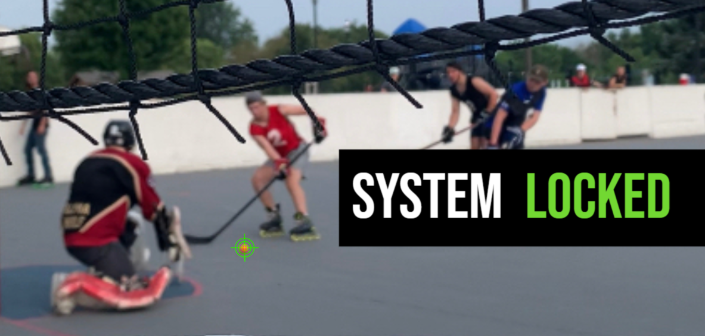

## Roller Hockey Puck Video Tracker
# ECE477 Senior Design

> A system designed to track roller hockey puck movement through video analysis.

---

## Repository Structure

| Folder Name | Description |
|-------------|-------------|
| [`C/`](./C) | Contains core C source code necessary to Build >> Flash using EXPRESSIF-IDF |
| [`uPython/`](./uPython) | MicroPython scripts used for Adafruit ESP32 Feather V2 Demos |
| [`Tracking_SW/`](./Tracking_SW) | Tracking software written in Python, including color & player detection algorithms |

---
